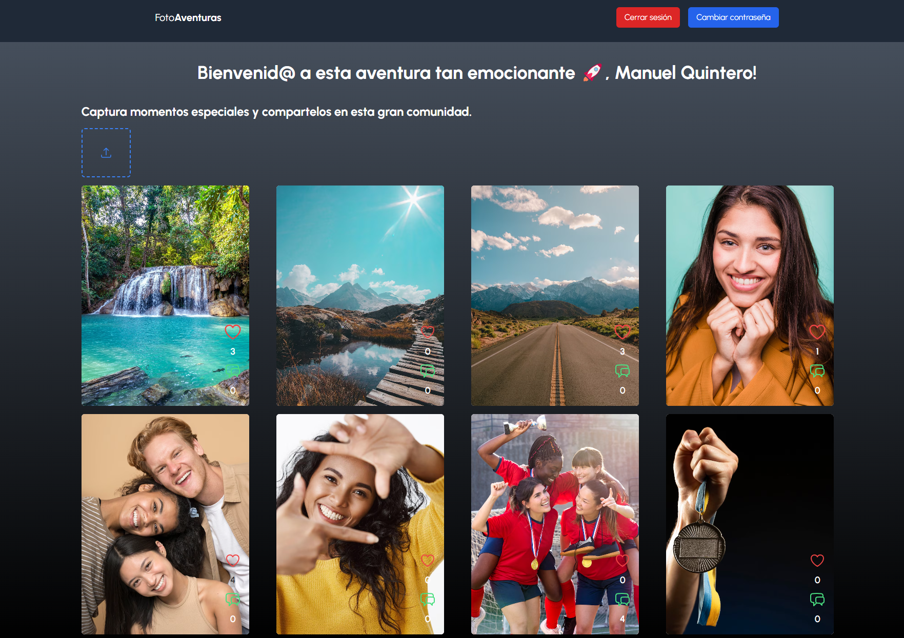

# 📸 Foto Aventura 🚀

¡Bienvenidos a **Foto Aventura**! 🎉

Foto Aventura es una aplicación interactiva creada con Next.js que invita a los usuarios a embarcarse en una aventura digital, capturando momentos especiales y compartiéndolos con una comunidad vibrante. 🌟

## 🚀 Características Principales

- **📷 Viaje Fotográfico:**
  - Toma y sube fotos capturando momentos de tu día a día o aventuras.
- **🖼️ Galería Comunitaria:**
  - Explora una galería dinámica donde puedes ver, compartir y reaccionar a las fotos de otros.
- **🔐 Registro y Autenticación de Usuarios:**
  - Utilizamos Firebase para manejar el registro y login de usuarios.
  - Métodos de autenticación:
    - Email/Contraseña
    - Autenticación Social
- **💾 Almacenamiento y Gestión de Datos:**
  - Almacenamos datos de usuarios y fotos en Firebase.
- **✨ Interacción y Diseño:**
  - Experiencia de usuario mágica y envolvente.
  - Diseñado con Tailwind CSS para estilos modernos y animaciones fluidas.

## 🚀 Comenzando

### 1. Clona el Repositorio

git clone https://github.com/tu-usuario/photo-adventure.git
cd photo-adventure

### 2. Instala las Dependencias

npm install

### 3. Configura Firebase

- Crea un proyecto en Firebase.
- Añade una aplicación web y copia la configuración.
- Configura Firebase en lib/firebase.js.

import { initializeApp, getApp, getApps } from "firebase/app";
import { getAuth } from "firebase/auth";
import { getFirestore } from "firebase/firestore";
import { getStorage } from "firebase/storage";

const firebaseConfig = {
apiKey: process.env.NEXT_PUBLIC_FIREBASE_API_KEY,
authDomain: process.env.NEXT_PUBLIC_FIREBASE_AUTH_DOMAIN,
projectId: process.env.NEXT_PUBLIC_FIREBASE_PROJECT_ID,
storageBucket: process.env.NEXT_PUBLIC_FIREBASE_STORAGE_BUCKET,
messagingSenderId: process.env.NEXT_PUBLIC_FIREBASE_MESSAGING_SENDER_ID,
appId: process.env.NEXT_PUBLIC_FIREBASE_APP_ID,
};

const app = !getApps.length ? initializeApp(firebaseConfig) : getApp();
const auth = getAuth(app);
const firestore = getFirestore(app);
const db = getFirestore(app);
const storage = getStorage(app);

export { db, storage, auth, firestore, app };

### 4. Inicia la Aplicación

npm run dev

## 📂 Estructura del Proyecto

photo-adventure/
├── public/
├── app/
│ ── dashboard
├──page.tsx
── login
├──page.tsx
── register
├──page.tsx
├── components/
│ ├── Footer.tsx
│ ├── Gallary.tsx
├── firebase/
│ ├── firebase.tsx
├── .env.local
├── .gitignore
├── README.md
├── package.json
├── tailwind.config.js
├── next.config.js

## 📸 Capturas de Pantalla

## 📜 Licencia

Este proyecto está bajo la Licencia de proyecto libre y codigo abierto.

## 🤝 Contribuciones

¡Las contribuciones son bienvenidas! Si tienes alguna idea para mejorar la aplicación, no dudes en hacer un fork del proyecto y enviar un pull request. 🙌

## 📞 Contacto

Correo: maluz1123@gmail.com
GitHub: @MLUZ1123
¡Gracias por visitar Photo Adventure! 🎉✨
